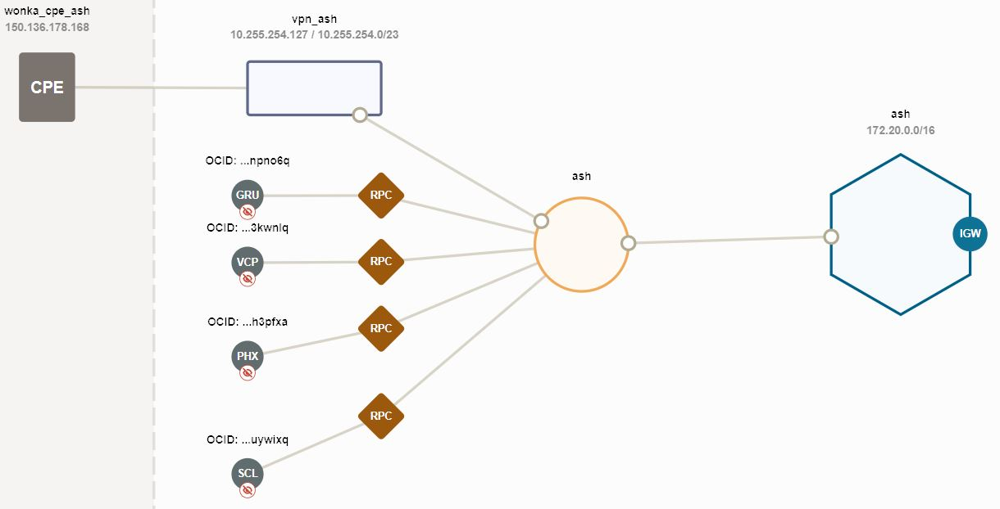
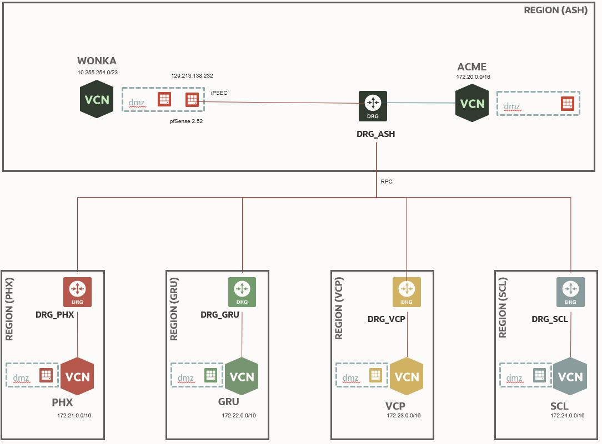

# OCI Virtual Network DRG - LAB
![version][version-img] 
## Intro
This code make avaiable in Jun/04/2020 initial version 1.0.
Objective is provide an working and described LAB environment to explore how to work and see some options on how works the new enhancements of OCI Dynamic Routing Gateway DRG.
this simple scenario ilustrated bellow. 
 
 
## The Architecture.
Wonka represents an onPrimses deployment. 
In this example I use pfSense because I had avaible to test. However, you can choose any Virtual Appliance Firewall of your choise that OCI Support. 
This code creates a Costomer OnPrimeses Equipment - CPE. In my case my pfSense Image deployed in my tenancy. 
Also, will deploy even the virtual apliance and configure the iPSEC from OCI side for you. Inside the virtual apliance you must configure the VPN settings.

 
Most of the cases the onPrime structure will be closer to a cloud region. This is the reason to also create an OCI deployment in ashburn.
This small OCI footprint has:
* VCN
* route table
* security list
* compute instance
* CPE
* VPN Connect
* DRG
  * RPC connections
  * Route distributions

Each OCI footprint deployment as distinct home regions. It is a multi region deployment.
This initial LAB makes configure the peerings from Ashburn to PHZ, GRU, VCP, SCL regions. You can follow the same configuration principal and connect the remains remote peering gatways as you wish.

## Terraform code
This initial version use was projected to be converted later to a git module and today is reciving parameters for each footprint deployment.
* Terraform version: v0.15.4
* OCI provider: 4.28.0

### Instructions: 
* Check if you have limits avables to deploy DRGs will be required 5.
* Rename the sample config file - sample_deploy_config.tf_sample to deploy_config.tf
* Adjust the following variables according your deployment:

  * OCI_HOME_REGION: tenancy home region e.g.: us-ashburn-1
  * OCI_USER_ID: use OCI console to retrieve the user id
  * OCI_API_KEY_FINGER_PRINT: add the API sining key you can ckeck Markup :  [Setup OCI Signing Key](https://docs.oracle.com/en-us/iaas/Content/Functions/Tasks/functionssetupapikey.htm)
  * private_key_path: 
    If you use MS Windows:
    file("MS WINDOWS STILE: C:\\Users\\mike\\.oci\\oci_api_key.pem"  
    If you use LINUX/MAC "/home/bozo/.oci/oci_api_key") 
  * OCI_VIRTUAL_APPLIANCE_FROM_MKTPLACE: In my case I’ve used pfSEnse. However, you can choose any firewall of next generation firewall available in OCI marketplace. You can also use the respective image ID from an custom image. This code consider this usage and will deploy also the instance for you and use the information to build the IPSEC configuration.

<!-- Markdown link & img dfn's -->
[version-img]: https://img.shields.io/badge/version-1.0-green
